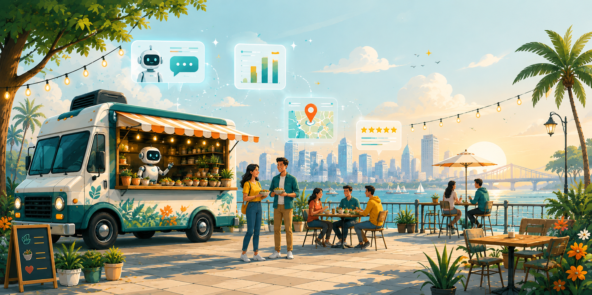
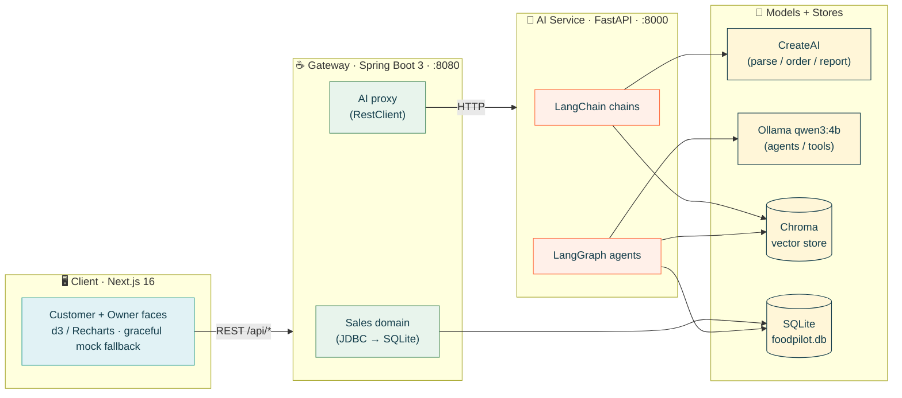
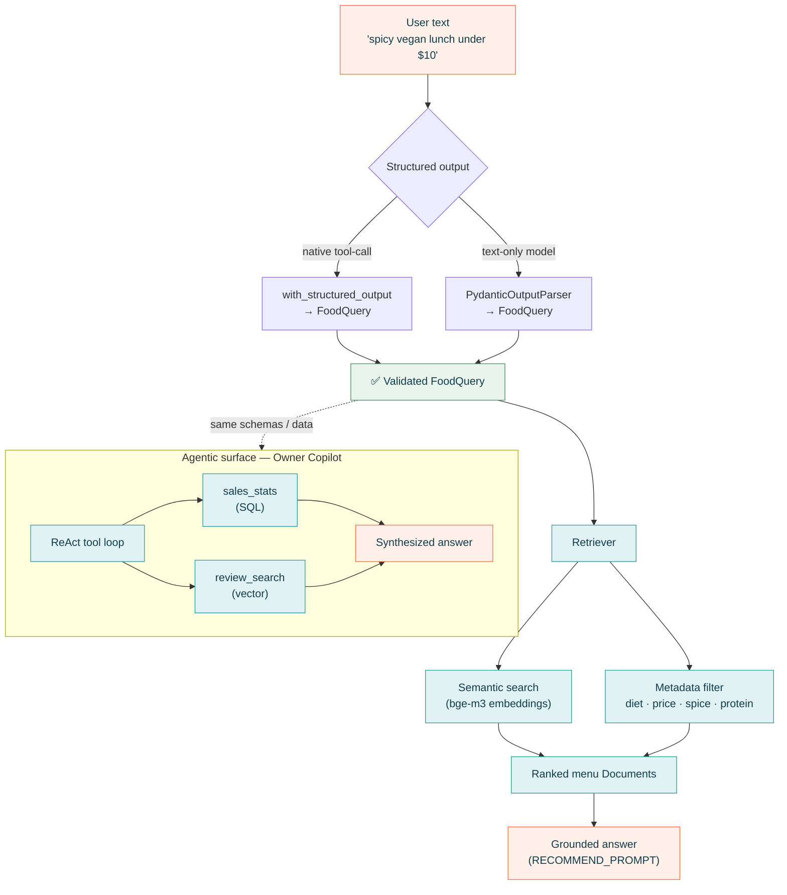
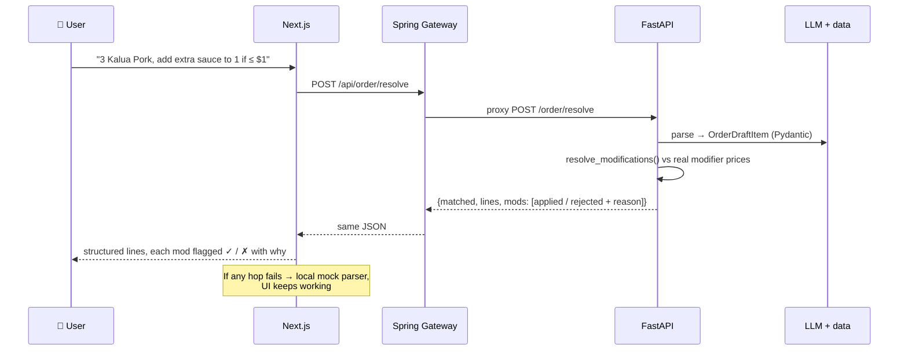

<p align="center">
  
</p>

<h1 align="center">🌮 FoodPilot AI</h1>

<p align="center">
  <strong>An AI-native operating platform for mobile food businesses.</strong><br/>
  A food-truck marketplace with an <em>AI concierge</em> for customers and an <em>AI operations copilot</em> for owners —
  built as a forcing function to learn the entire modern agent stack, from LangChain to LangGraph to production microservices.
</p>

<p align="center">
  
  
  
  
  
  
  
  
  
</p>

---

## TL;DR

FoodPilot is **not** "a food chatbot using LangChain." It is a full-stack, four-tier product where every AI abstraction was adopted **only when a real feature forced it** — and the moments where a framework *stopped being enough* are documented, not hidden. The result is a system that reads like a product **and** a curriculum:

- 🧠 **AI Concierge** — turns `"cheap spicy vegan lunch under $10"` into a validated query, then grounds an answer in a real 635-item menu via RAG.
- 🛒 **Order Builder** — parses a messy multi-part order (`"3 Kalua Pork, add extra sauce to 1 only if it's under $1"`) into structured lines and resolves every modifier against real prices.
- 📊 **Owner Copilot** — a tool-calling agent that answers `"why did Tokachi's sales drop?"` by querying SQL sales **and** semantically searching reviews, then synthesizing both.
- 🔎 **Review Intelligence** — a map-reduce RAG pipeline that turns 150 unstructured reviews into a ranked, quantified complaint report an owner can act on.

Everything degrades gracefully: if the AI services are down, the frontend falls back to local mocks and keeps working.

---

## Table of contents

- [Why this project exists](#why-this-project-exists)
- [Feature tour](#feature-tour)
- [System architecture](#system-architecture)
- [The AI brain](#the-ai-brain)
- [Anatomy of one request](#anatomy-of-one-request)
- [The learning arc — hitting the wall on purpose](#the-learning-arc--hitting-the-wall-on-purpose)
- [Tech stack](#tech-stack)
- [Data at a glance](#data-at-a-glance)
- [Repository layout](#repository-layout)
- [Getting started](#getting-started)
- [Roadmap](#roadmap)
- [Banner image prompt](#banner-image-prompt)

---

## Why this project exists

Most people learn LangChain by copying a tutorial. FoodPilot inverts that: it starts from a **real product** with two hard realism anchors and lets those anchors generate the AI problems.

> **Food trucks move.** Location is time-scoped, not a static address.
> **Things sell out.** Availability and inventory change per-truck, over time.

Those two facts are why the project can't stay a linear chain forever — it *needs* persistent, mutable, branching state, which is exactly the problem LangGraph solves. Rather than assert that, the codebase **walks into the wall** at each phase and writes up what broke ([`LOOP_LIMITATIONS.md`](LOOP_LIMITATIONS.md), [`LANGCHAIN_WALL.md`](LANGCHAIN_WALL.md)). Each `chapter/` doc is a narrated build log of one phase.

---

## Feature tour

| Surface | What it does | The AI pattern behind it |
|---|---|---|
| **Concierge** | Conversational food search that remembers constraints across turns | Chat model + LCEL + message history + RAG |
| **Order Builder** | Natural-language order → structured lines + resolved modifiers, with live pricing and a full customizable menu | Structured output under pressure (Pydantic) + deterministic modifier resolver |
| **Owner Copilot** | "How are sales? What are people complaining about?" | Prebuilt tool-calling agent over **SQL + vector** tools |
| **Review Intelligence** | 150 reviews → ranked complaint table | Map-reduce RAG as a *reporting* engine (`.batch()`) |
| **Prep Planner** | "Prepare me for tomorrow" — forecast → ingredients → shortfall → supplier plan | Linear LCEL chain (and where it visibly breaks) |

---

## System architecture

Four tiers. The browser never talks to Python directly — the Java gateway is the single front door, owning the sales domain itself (via JDBC) and proxying everything AI-heavy to the Python brain.



**Why a Java gateway in front of a Python brain?** To model a realistic polyglot backend: latency-sensitive, plain-SQL analytics stay in a fast typed service; the messy, model-heavy work lives in Python where the ecosystem is. The seam between them is deliberate.

---

## The AI brain

The Python service is where the interesting work happens. Two model backends sit behind one factory (`app/llm.py`, `app/createai_llm.py`) so providers can be swapped in one place. Retrieval combines **semantic search + exact metadata filtering** — the fuzzy concepts (cuisine) go to embeddings, the hard constraints (diet, price, spice, protein) go to a metadata `where` clause.



**One lesson worth stealing:** `with_structured_output` and `PydanticOutputParser` guarantee the *shape* of the output — they cannot guarantee its *content* is semantically correct. Shape is a framework guarantee; content is a model-capability problem. Telling those two apart is most of the battle.

---

## Anatomy of one request

What actually happens when a customer types a messy order into the Order Builder:



Every modification is checked against the truck's **real** modifier data (2,600+ modifiers): "extra sauce" is applied only if its true `price_delta` satisfies the condition; anything that can't apply is returned with a human-readable reason instead of silently dropped.

---

## The learning arc — hitting the wall on purpose

The whole point is to feel *why* each abstraction exists. Each phase is a working deliverable **and** a documented "here's what broke."

```mermaid
flowchart LR
    P1["1 · Structured<br/>output"] --> P2["2 · RAG<br/>retrievers"] --> P3["3 · Memory"]
    P3 --> P4["4 · Manual<br/>tool loop"] --> P5["5 · Prebuilt<br/>agent"]
    P5 --> W1{{"🧱 Wall #1<br/>model + loop limits"}}
    W1 --> P6["6 · Structured<br/>output under<br/>pressure"] --> P7["7 · SQL + RAG<br/>copilot"] --> P8["8 · Review<br/>intelligence"]
    P8 --> P9["9 · Multi-step<br/>reasoning"] --> W2{{"🧱 Wall #2<br/>chains can't branch,<br/>loop, pause, persist"}}
    W2 --> LG(["➡️ LangGraph"])

    classDef done fill:#E8F4EC,stroke:#4F8F68,color:#123C4A;
    classDef wall fill:#FFF0E9,stroke:#FF7043,color:#123C4A;
    classDef next fill:#E1F2F5,stroke:#2A9D9A,color:#123C4A;
    class P1,P2,P3,P4,P5,P6,P7,P8,P9 done;
    class W1,W2 wall;
    class LG next;
```



| Phase | Deliverable | The abstraction it forces |
|---|---|---|
| 1 | Text → validated `FoodQuery` | Chat models, LCEL, structured output |
| 2 | Grounded recommendations | RAG: semantic search + metadata filtering |
| 3 | Multi-turn concierge | Message history / memory |
| 4 | Hand-written tool loop | Tool binding — see what an agent *automates* |
| 5 | "FEED ME" prebuilt agent | Agent ceiling → [`LOOP_LIMITATIONS.md`](LOOP_LIMITATIONS.md) |
| 6 | Order + modifier resolver | Structured output under real-world mess |
| 7 | Owner Copilot | One agent over **SQL + vector** tools |
| 8 | Complaint report | Map-reduce RAG via `.batch()` (reporting, not Q&A) |
| 9 | "Prepare me for tomorrow" | Linear chain — and where it breaks → [`LANGCHAIN_WALL.md`](LANGCHAIN_WALL.md) |
| → | **LangGraph** | Branch, loop, pause, persist |

Each phase has a full write-up in [`chapter/`](chapter/).

---

## Tech stack

| Layer | Technology |
|---|---|
| **Frontend** | Next.js 16 · React 19 · TypeScript · Tailwind · Base UI (shadcn) · Framer Motion · d3 + Recharts |
| **Gateway** | Java 17+ · Spring Boot 3 · Spring Web · JDBC (HikariCP) |
| **AI service** | Python 3.11 · FastAPI · Uvicorn |
| **AI framework** | LangChain 1.3 · LangGraph 1.2 · Pydantic |
| **Models** | ASU CreateAI (hosted) · Ollama `qwen3:4b` (tools) · `bge-m3` (embeddings) |
| **Data** | SQLite (`foodpilot.db`) · Chroma vector store · JSON seed data |

---

## Data at a glance

Realistic, cuisine-matched seed data generated from a real Yelp SF food-truck scrape:

| Entity | Count | | Entity | Count |
|---|--:|---|---|--:|
| 🚚 Trucks | **107** | | 🧾 Orders | **260** |
| 🍽️ Menu items | **635** | | 🧩 Modifiers | **2,622** |
| ⭐ Reviews | **150** | | 🥕 Ingredients | **179** |
| 📋 Recipes | **1,887** | | | |

`recipes.json` is the hinge that turns "sell 5 bowls" into "need 0.6 kg of X" — the link that makes the Prep Planner possible.

---

## Repository layout

```
foodtruck-cuisine/
├── app/                 # 🧠 The AI brain (LangChain chains + LangGraph agents)
│   ├── chains.py            # LCEL pipelines: parse, recommend, classify, order
│   ├── agent.py             # manual tool loop + prebuilt agents (copilot)
│   ├── tools.py             # real @tool functions over the data (SQL + JSON)
│   ├── retrievers.py        # Chroma RAG: semantic + metadata filtering
│   ├── analytics.py         # map-reduce review reporting
│   ├── prep.py              # linear prep-planning chain
│   └── createai_llm.py      # custom ChatCreateAI(BaseChatModel) wrapper
├── ai_service/          # 🐍 FastAPI service exposing the brain over HTTP
├── gateway/             # ☕ Spring Boot gateway (SQL sales + AI proxy)
├── web/                 # 🖥️ Next.js "Sky Market" frontend
├── data/                # 📦 JSON seed data (trucks, menus, orders, reviews…)
├── chapter/             # 📖 Narrated build log, one file per phase
├── main.py              # terminal REPL to drive every phase by hand
└── FoodPilot_Master_Spec.md   # the full spec + curriculum
```

---

## Getting started

**Prerequisites:** Python 3.11, Node 18+, Java 17+ (Maven), and [Ollama](https://ollama.com) running locally.

```bash
# 0) Python env + deps  (venv is named "cuisine" on purpose)
python -m venv cuisine && source cuisine/bin/activate
pip install -r requirements.txt

# Pull local models
ollama pull qwen3:4b && ollama pull bge-m3
```

### Drive the AI by hand (terminal-first)

```bash
python main.py     # REPL: parse · recommend · tools · FEED ME · order · copilot · report
```

### Run the full product (three terminals, in order)

```bash
./scripts/run-ai.sh          # 🐍 AI service   → http://localhost:8000
./scripts/run-gateway.sh     # ☕ Java gateway  → http://localhost:8080
cd web && npm install && npm run dev   # 🖥️ Frontend → http://localhost:3000
```

Verify the whole chain is healthy:

```bash
curl -s http://localhost:8080/api/health
# {"gateway":"up","ai":{"status":"ok","service":"foodpilot-ai"}}
```

> **Note:** the frontend runs standalone too — if the gateway or AI service is down, screens fall back to local mock data, so you can explore the UI without any backend.

---

## Roadmap

Beyond finishing the LangGraph phases, the production-hardening path:

- **Models** — swap local Ollama for a hosted frontier model (kills the tool-calling workarounds); stream tokens end-to-end (SSE); add a semantic response cache.
- **Data** — unify the split JSON/SQLite sources onto one store; migrate SQLite → Postgres + `pgvector` (retire Chroma).
- **Services** — async FastAPI handlers; background jobs for the review report; auth + rate limiting; Resilience4j circuit breakers on the AI hop.
- **Frontend** — React Query for fetching/caching; streaming chat UI; optimistic order updates.
- **Ops** — the missing layer: tests (pytest / vitest / JUnit), Docker Compose one-command boot, CI, and OpenTelemetry tracing.

---

## Banner image prompt

The current banner lives at `web/public/images/banner_image.png`. To regenerate it, use this prompt with your image generator of choice (Midjourney / DAL·E / SDXL) at **1600×400**.

> Wide cinematic hero banner, 1600×400, for an AI-native food-truck platform called **FoodPilot**. A stylized modern food truck on the left, softly illuminated, parked on a clean city street at golden hour. Floating around it, glowing holographic UI cards suggesting AI: a chat bubble, a small bar chart, a map pin, a star rating — rendered in a light, airy "sky market" aesthetic. Color palette strictly: petrol blue `#123C4A`, tangerine orange `#FF7043`, turquoise `#2A9D9A`, leaf green `#4F8F68`, butter yellow `#FFD76A`, on a soft misty-blue background `#EEF7F8`. Flat-modern illustration with subtle depth and soft shadows, generous negative space on the right for a title overlay, friendly and premium, no text, no words, no logos. High detail, crisp vector-like edges, tech-startup product banner.

<p align="center"><sub>Built as a hands-on journey from LangChain fundamentals to production agentic AI. 🚚✨</sub></p>
